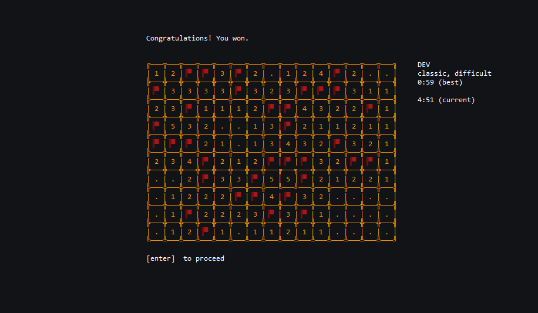
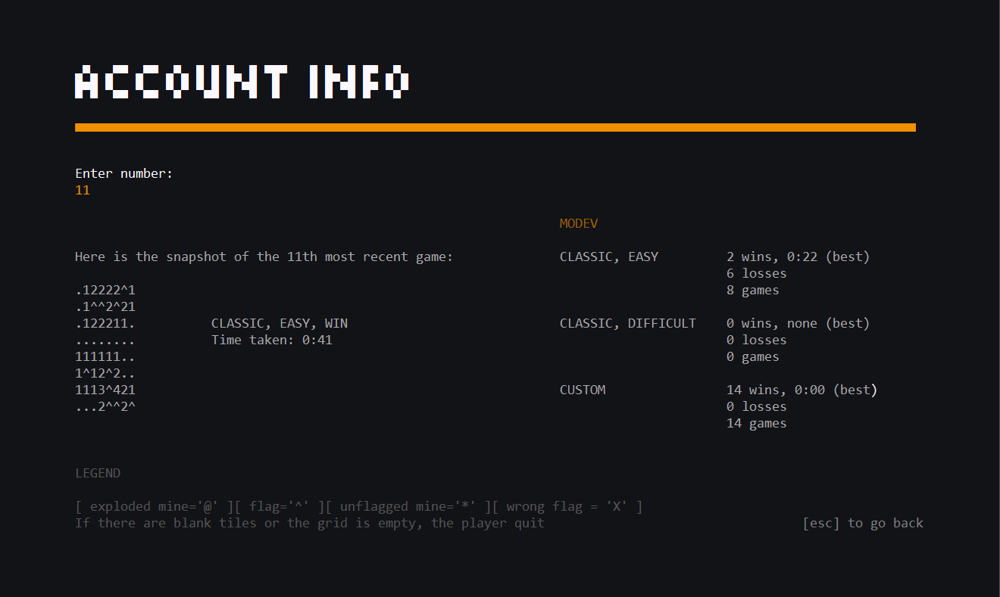
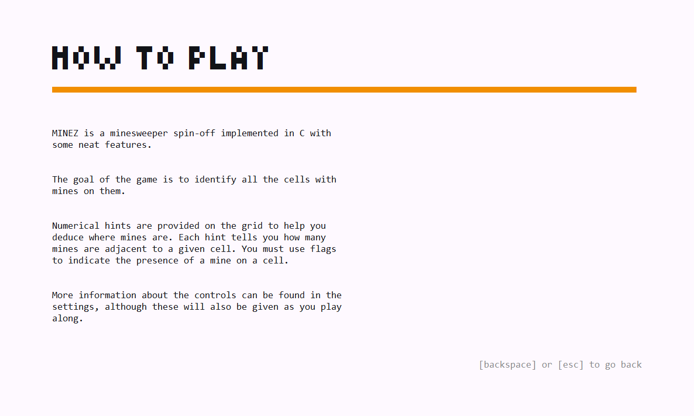
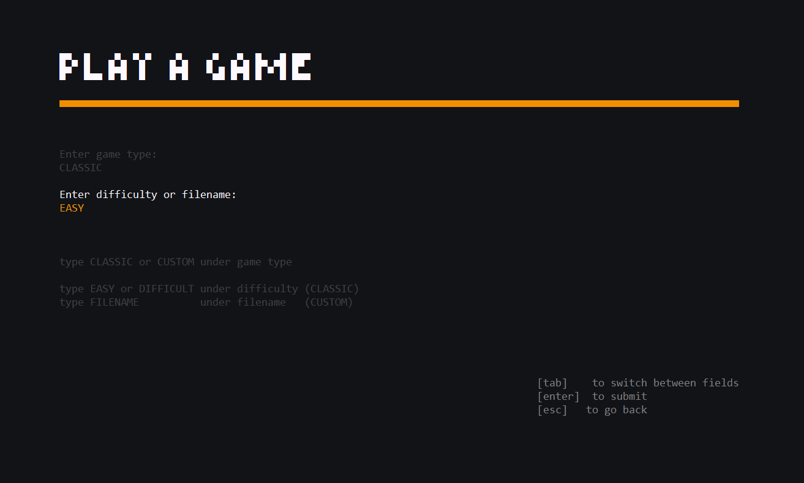
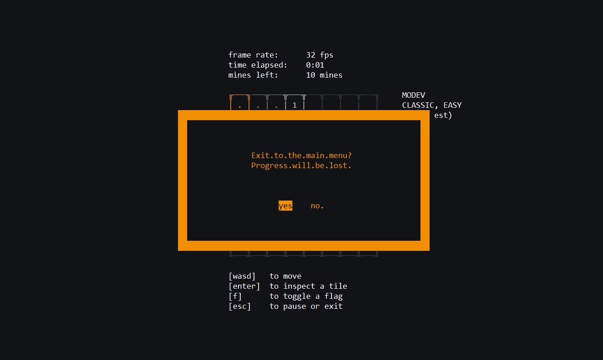
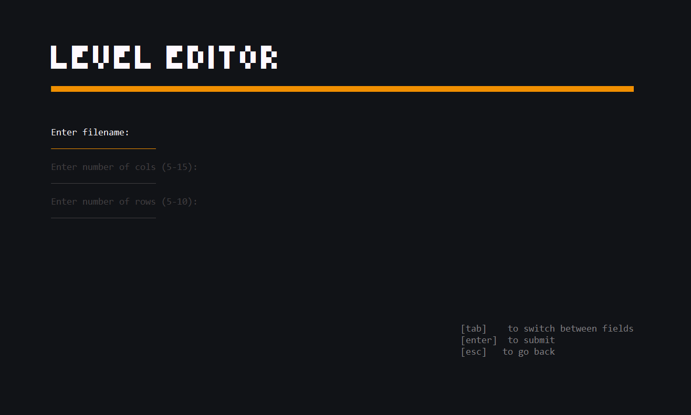
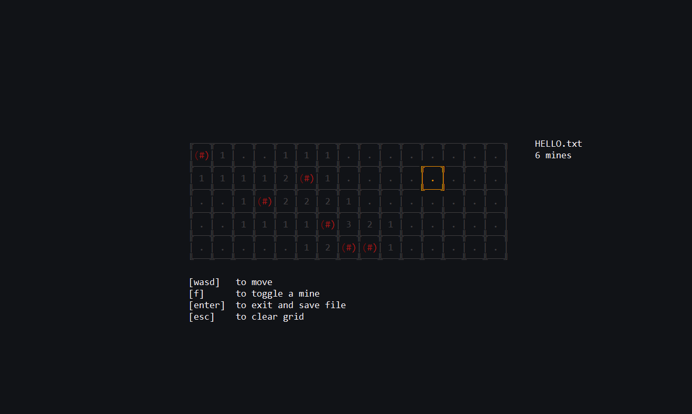

# MINEZ
<!-- 
<pre>
    ▀████▄     ▄███▀▀████▀▀███▄   ▀███▀▀███▀▀▀███ ███▀▀▀███         █      
      ████    ████    ██    ███▄    █    ██    ▀█ █▀   ███      ▀▄█████▄▀  
      █ ██   ▄█ ██    ██    █ ███   █    ██   █   ▀   ███       ██  █████  
      █  ██  █▀ ██    ██    █  ▀██▄ █    ██████      ███      ▀▀█████████▀▀
      █  ██▄█▀  ██    ██    █   ▀██▄█    ██   █  ▄  ███   ▄     ▀███████▀  
      █  ▀██▀   ██    ██    █     ███    ██     ▄█ ███   ▄█     ▀ ▀▀█▀▀ ▀  
    ▄███▄ ▀▀  ▄████▄▄████▄▄███▄    ██  ▄███████████████████         ▀      
</pre> -->


> **NOTE:** The github repo for this project was made public after its associated submission deadline and not without the permission of the course instructor and project specification author ([Sir Thomas Tiam-Lee](https://github.com/thomastiamlee)).




## 1 Running the Program

### 1.1 Windows 10

If you are using Windows 10 and have not migrated to using the modern Windows Terminal (you're still using conhost), then the following commands should suffice to run the program. Otherwise, refer to the commands for Windows 11; the Windows Terminal has a different set of features which don't allow our program to do some important stuff (like resizing the console).

```C
gcc main.c -o main
main run
```

### 1.2 Windows 11

Fortunately, even after migrating to using the Windows Terminal, the legacy console (conhost) is still accessible when running it directly using the `conhost` command (or, alternatively, looking for it manually in your Windows folder). After the console appears, just follow the same commands outlined for Windows 10.

```
conhost
gcc main.c -o main
main run
```

### 1.3 Unix-based

Need I say more?

```
gcc main.c -o main
./main run
```

### 1.4 `run` Parameter

If you do not specify the `run` parameter after calling the main executable, you will be greated with the following message:
>

To actually run the program, you must specify the `run` parameter.
As an added feature, **one can also specify `run dev` instead**; this will run an alternative executable used for debugging.

---

## 2 Project Structure

```
📦machine-project
 ┣ 📂build
 ┃ ┣ 📂.debug
 ┃ ┃ ┣ 📜debug.txt
 ┃ ┃ ┣ 📜log.unix.txt
 ┃ ┃ ┣ 📜log.win.txt
 ┃ ┣ 📂levels
 ┃ ┃ ┣ 📜.levels.data.txt
 ┃ ┃ ┣ 📜DEV.txt
 ┃ ┃ ┗ 📜RUSSIAN-ROULETTE.txt
 ┃ ┣ 📜minesweeper.unix.o
 ┃ ┗ 📜minesweeper.win.exe
 ┣ 📂src
 ┃ ┣ 📂assets
 ┃ ┃ ┣ 📜body-font.asset.txt
 ┃ ┃ ┣ 📜header-font.asset.txt
 ┃ ┃ ┣ 📜icon.asset.txt
 ┃ ┃ ┗ 📜logo.asset.txt
 ┃ ┣ 📂data
 ┃ ┃ ┣ 📂profiles
 ┃ ┃ ┃ ┣ 📜LYZA.txt
 ┃ ┃ ┃ ┣ 📜MODEV.txt
 ┃ ┃ ┃ ┗ 📜profiles.data.txt
 ┃ ┃ ┗ 📜themes.data.txt
 ┃ ┣ 📂game
 ┃ ┃ ┣ 📜editor.game.c
 ┃ ┃ ┣ 📜field.obj.h
 ┃ ┃ ┣ 📜game.c
 ┃ ┃ ┣ 📜profile.game.c
 ┃ ┃ ┗ 📜stats.game.c
 ┃ ┣ 📂pages
 ┃ ┃ ┣ 📜account.page.c
 ┃ ┃ ┣ 📜editor.interactive.page.c
 ┃ ┃ ┣ 📜editor.page.c
 ┃ ┃ ┣ 📜help.page.c
 ┃ ┃ ┣ 📜login.page.c
 ┃ ┃ ┣ 📜menu.page.c
 ┃ ┃ ┣ 📜play.interactive.page.c
 ┃ ┃ ┣ 📜play.page.c
 ┃ ┃ ┗ 📜settings.page.c
 ┃ ┣ 📂utils
 ┃ ┃ ┣ 📂unix
 ┃ ┃ ┃ ┣ 📜utils.io.unix.h
 ┃ ┃ ┃ ┣ 📜utils.string.unix.h
 ┃ ┃ ┃ ┗ 📜utils.thread.unix.h
 ┃ ┃ ┣ 📂win
 ┃ ┃ ┃ ┣ 📜utils.io.win.h
 ┃ ┃ ┃ ┣ 📜utils.string.win.h
 ┃ ┃ ┃ ┗ 📜utils.thread.win.h
 ┃ ┃ ┣ 📜utils.asset.h
 ┃ ┃ ┣ 📜utils.buffer.h
 ┃ ┃ ┣ 📜utils.component.h
 ┃ ┃ ┣ 📜utils.event.h
 ┃ ┃ ┣ 📜utils.file.h
 ┃ ┃ ┣ 📜utils.graphics.h
 ┃ ┃ ┣ 📜utils.grid.h
 ┃ ┃ ┣ 📜utils.hashmap.h
 ┃ ┃ ┣ 📜utils.io.h
 ┃ ┃ ┣ 📜utils.math.h
 ┃ ┃ ┣ 📜utils.page.h
 ┃ ┃ ┣ 📜utils.queue.h
 ┃ ┃ ┣ 📜utils.string.h
 ┃ ┃ ┣ 📜utils.theme.h
 ┃ ┃ ┣ 📜utils.thread.h
 ┃ ┃ ┗ 📜utils.types.h
 ┃ ┣ 📜engine.c
 ┃ ┣ 📜events.c
 ┃ ┣ 📜minesweeper.c
 ┃ ┣ 📜minesweeper.dev.c
 ┃ ┗ 📜settings.c
 ┣ 📜.gitignore
 ┣ 📜.TODO.txt
 ┣ 📜main
 ┣ 📜main.c
 ┗ 📜main.exe
```
> **NOTE:** the README and its associated files are excluded here.
> Additionally, the `.debug` folder is not populated in the github repo
> but may contain additional files following the build process.

### 2.1 `build`, `src`, and `main.c`

The three main components of the file tree are the `build` and `src` folders, alongside the `main.c` file.


The `main.c` file basically just acts as a "makefile" for the entire project (since we couldn't really use a makefile without enforcing people to install it for our project). 

The `build` folder contains the resulting executables produced by `main.c`, which depend on the environment running the build step. Any additional logs and debug files are also created here and may be viewed in a text editor.

The `src` folder contains the actual source code that enables the game to operate. Any state and data files relevant to the program might also be created here (for instance, files containing information about user accounts, file containing program settings, and files containing text art assets and theme options).

### 2.2 `src/utils`

This folder basically contains a library of utilities that enable the game to function. None of the files here implement any of the game logic, and this library can be used for any other program. Nonetheless, it is important to note that some of the files contained in this folder depend on other utility files also included herein.

### 2.3 `src/pages`, `src/events.c`, `src/engine.c`, and `src/game`

`engine.c` runs the main thread of the program and manages all the other subthreads. It's basically the brain of the program. `events.c` contains custom definitions for events (in this case, just key presses).

`src/pages` containes the implementation for both the UI and the key handling of each of the pages of the program. These pages are managed by a page manager "class".

`src/game` contains all the logic that implements the functionalities specific to the game. Profile management, gameplay, level editing, and the like are contained in their respective files here.

### 2.4 `src/minesweeper.c` and `src/minesweeper.dev.c`

The `minesweeper.c` file contains the `main` function of the actual program. The latter `minesweeper.dev.c` houses an alternative version of the `main` function with random pieces of code we might want to test. To compile the `.dev` file instead of the default one, 

```
gcc main.c -o main
main run dev
```

The `dev` parameter builds the dev file instead.

### 2.5 `src/assets` and `src/data`

These folders contain persistent data we want to keep and use even after the program executes. By default there are two accounts, although these may be promptly deleted when needed.

---

## 3 Implementation Outline

### 3.1 Multithreading

This took a while to figure out, particularly because all the superficial search engine results for "multithreading in C" bring up pthreads, which is not part of the 1999 C Standard Library. Initially, the thought of implementing multithreading was shelved; the ONLY reason we were considering it was because it was necessary in order to implement a functional timer in game which would not block user input. However, it was soon realized that the Windows OS offered an API to manage multithreading within a C program. This was exploited in order to create more than just a time. With multithreading, event handling also became possible, alongside animations, although the latter was eventually discarded because of the overhead the implementation incurred.

### 3.2 Event Handling

Events are simply delegated their own thread and triggers for these events are executed there. They are then queued and handled by the main thread when the opportunity arises (when it becomes free to do so). Events can be of different types, although in the final version of the program only key-based events are actually used.


### 3.3 Component Tree

Some inspiration is taken from web development, where most UIs are represented by trees of components. The same is done here; a tree is used to facilitate the structure of the different components currently on the screen, and each of these components are rendered on a breadth-first search basis.

### 3.4 Page Handling

To ensure the development process doesn't end up becoming terribly hairy from all the condition checking and what not, a page manager was introduced to mediate the control of the program between different pages. This improved the way the source code could be developed. Nevertheless, it is also true that within their respective files, each individual page did end up having a rather convoluted if-else tree for handling key inputs. This, however, was able to suffice, and the program works as expected (so far).

### 3.5 Text Assets

Initially, it was conceived to place all text assets within the source code as inline definitions. However, this soon became cumbersome and polluted the code with a lot of variable names and what not. The idea to store these separately in text files made development easier and allowed for the increased flexibility of the UI.

### 3.6 Object-oriented Programming (?)

C is not an object oriented language, nor is it properly functional... or is it? C can be both of those things, with the right code structure and implementations! Some principles of OOP were used to implement this program, and certain design patterns were employed to ensure the robustness and flexibility of the codebase. For instance, delegating a manager to each class (which would abstract the creation of instances of those class, alongside other things) was a recurring theme within the project.

### 3.7 Debugging

There is actually a `utils.debug.h` file not included in the machine project source code simply because the file uses a global variables to log things to a file much more conveniently. This file was used extensively during the development process.

Additionally, as mentioned earlier, the `dev` flag specified during compile time can help run isolated blocks of code placed within `minesweeper.dev.c`, thereby making the debugging process much more efficient.

Lastly, Valgrind was used to ensure minimal memory leaks occured during the runtime of the program. Without the help of Valgrind, our program would have leaked 4MB of memory at startup, every time!

---

## 4 Test Script

The test script function table is located in the README folder. Do note that only a small subset of the functions in the code are included in the test script, primarily because most of the functions mutate state outside of their scopes (they're impure functions that take in pointers to massive structs as inputs); thus, writing unit tests for these functions was nigh impossible.

---

## 5 Screenshots

Last but not least, we present an archive of screenshots to present a teaser for what the program has to offer.

### 5.1 Logging In and Menu


### 5.2 Account, Settings, Help Pages






### 5.3 Gameplay






### 5.4 Editor



