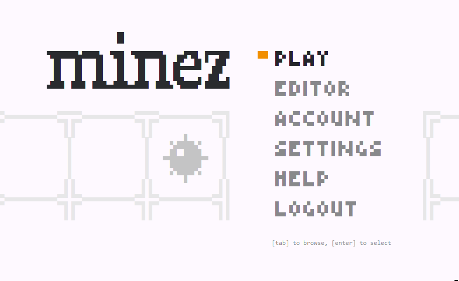
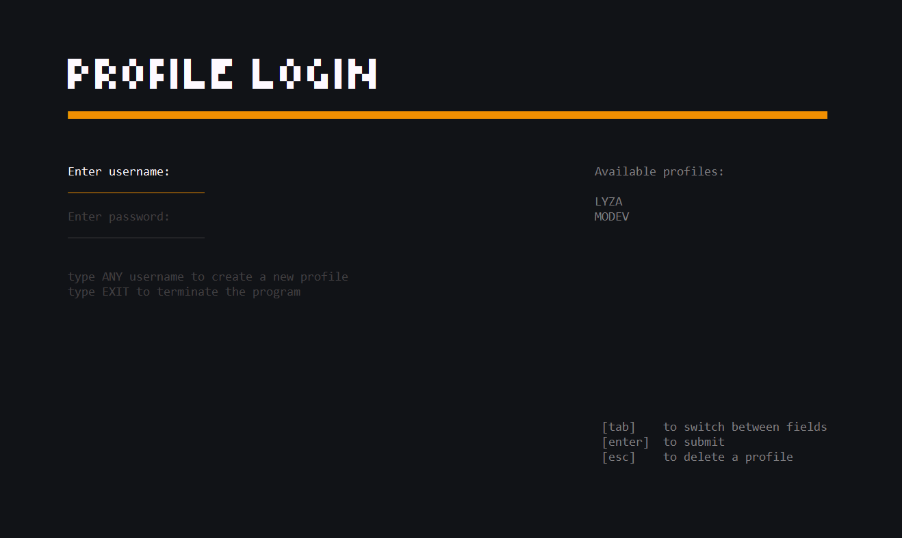

# MINEZ (in C)
<!-- 
<pre>
    ▀████▄     ▄███▀▀████▀▀███▄   ▀███▀▀███▀▀▀███ ███▀▀▀███         █      
      ████    ████    ██    ███▄    █    ██    ▀█ █▀   ███      ▀▄█████▄▀  
      █ ██   ▄█ ██    ██    █ ███   █    ██   █   ▀   ███       ██  █████  
      █  ██  █▀ ██    ██    █  ▀██▄ █    ██████      ███      ▀▀█████████▀▀
      █  ██▄█▀  ██    ██    █   ▀██▄█    ██   █  ▄  ███   ▄     ▀███████▀  
      █  ▀██▀   ██    ██    █     ███    ██     ▄█ ███   ▄█     ▀ ▀▀█▀▀ ▀  
    ▄███▄ ▀▀  ▄████▄▄████▄▄███▄    ██  ▄███████████████████         ▀      
</pre> -->

## 1 Introduction

> Sample gameplay (classic, easy)


> Sample gameplay (classic, difficult)


> The home page



> The login page



Welcome to a rough implementation of minesweeper... in C!
Brought to you by MMMM.

## 2 Running the Program

### Windows 10

If you are using Windows 10 and have not migrated to using the modern Windows Terminal (you're still using conhost), then the following commands should suffice to run the program. Otherwise, refer to the commands for Windows 11; the Windows Terminal has a different set of features which don't allow our program to do some important stuff (like resizing the console).

```C
gcc main.c -o main
main run
```

### Windows 11

Fortunately, even after migrating to using the Windows Terminal, the legacy console (conhost) is still accessible when running it directly using the `conhost` command (or, alternatively, looking for it manually in your Windows folder). After the console appears, just follow the same commands outlined for Windows 10.

```
conhost
gcc main.c -o main
main run
```

### Unix-based

Need I say more?

```
gcc main.c -o main
./main run
```
---
> NOTE: If you do not specify the `run` parameter after calling the main executable, you will be greated with the following message:
> 
> To actually run the program, you must specify the `run` parameter.
> 
> As an added feature, **one can also specify `run dev` instead**; this will run an alternative executable used for debugging.

## 3 Project Structure

```
📦machine-project
 ┣ 📂build
 ┃ ┣ 📂.debug
 ┃ ┃ ┣ 📜debug.txt
 ┃ ┃ ┣ 📜log.unix.txt
 ┃ ┃ ┗ 📜log.win.txt
 ┃ ┣ 📜minesweeper.unix.o
 ┃ ┗ 📜minesweeper.win.exe
 ┣ 📂src
 ┃ ┣ 📂assets
 ┃ ┃ ┣ 📜body-font.asset.txt
 ┃ ┃ ┣ 📜header-font.asset.txt
 ┃ ┃ ┣ 📜icon.asset.txt
 ┃ ┃ ┣ 📜intro.asset.txt
 ┃ ┃ ┗ 📜menu.asset.txt
 ┃ ┣ 📂data
 ┃ ┃ ┣ 📜accounts.data.txt
 ┃ ┃ ┗ 📜themes.data.txt
 ┃ ┣ 📂game
 ┃ ┃ ┣ 📜account.class.h
 ┃ ┃ ┗ 📜field.obj.h
 ┃ ┣ 📂pages
 ┃ ┃ ┣ 📜account.page.c
 ┃ ┃ ┣ 📜custom.page.c
 ┃ ┃ ┣ 📜help.page.c
 ┃ ┃ ┣ 📜intro.page.c
 ┃ ┃ ┣ 📜menu.page.c
 ┃ ┃ ┣ 📜play.page.c
 ┃ ┃ ┗ 📜settings.page.c
 ┃ ┣ 📂utils
 ┃ ┃ ┣ 📂unix
 ┃ ┃ ┃ ┣ 📜utils.io.unix.h
 ┃ ┃ ┃ ┣ 📜utils.string.unix.h
 ┃ ┃ ┃ ┗ 📜utils.thread.unix.h
 ┃ ┃ ┣ 📂win
 ┃ ┃ ┃ ┣ 📜utils.io.win.h
 ┃ ┃ ┃ ┣ 📜utils.string.win.h
 ┃ ┃ ┃ ┗ 📜utils.thread.win.h
 ┃ ┃ ┣ 📜utils.aes.h
 ┃ ┃ ┣ 📜utils.asset.h
 ┃ ┃ ┣ 📜utils.buffer.h
 ┃ ┃ ┣ 📜utils.component.h
 ┃ ┃ ┣ 📜utils.debug.h
 ┃ ┃ ┣ 📜utils.event.h
 ┃ ┃ ┣ 📜utils.file.h
 ┃ ┃ ┣ 📜utils.graphics.h
 ┃ ┃ ┣ 📜utils.grid.h
 ┃ ┃ ┣ 📜utils.hashmap.h
 ┃ ┃ ┣ 📜utils.io.h
 ┃ ┃ ┣ 📜utils.math.h
 ┃ ┃ ┣ 📜utils.page.h
 ┃ ┃ ┣ 📜utils.queue.h
 ┃ ┃ ┣ 📜utils.string.h
 ┃ ┃ ┣ 📜utils.theme.h
 ┃ ┃ ┣ 📜utils.thread.h
 ┃ ┃ ┗ 📜utils.types.h
 ┃ ┣ 📜engine.c
 ┃ ┣ 📜events.c
 ┃ ┣ 📜minesweeper.c
 ┃ ┗ 📜minesweeper.dev.c
 ┣ 📜main
 ┣ 📜main.c
 ┣ 📜main.exe
```
> **NOTE:** the README and its associated files are excluded here.
> Additionally, the `.debug` folder is not populated in the github repo
> but may contain additional files following the build process.

### 3.1 `build`, `src`, and `main.c`

The three main components of the file tree are the `build` and `src` folders, alongside the `main.c` file.


The `main.c` file basically just acts as a "makefile" for the entire project (since we couldn't really use a makefile without enforcing people to install it for our project). 

The `build` folder contains the resulting executables produced by `main.c`, which depend on the environment running the build step. Any additional logs and debug files are also created here and may be viewed in a text editor.

The `src` folder contains the actual source code that enables the game to operate. Any state and data files relevant to the program might also be created here (for instance, files containing information about user accounts, file containing program settings, and files containing text art assets and theme options).

### 3.2 `src/utils`

This folder basically contains a library of utilities that enable the game to function. None of the files here implement any of the game logic, and this library can be used for another program entirely. Nonetheless, it is important to note that some of the files contained in this folder depend on other utility files also included therein.

### 3.3 `src/pages`, `src/events.c`, `src/engine.c`, and `src/game`

### 3.4 `src/minesweeper.c` and `src/minesweeper.dev.c`

### 3.5 `src/assets` and `src/data`

## 4 Implementation Outline

## 5 Test Script

## 6 About the Authors 